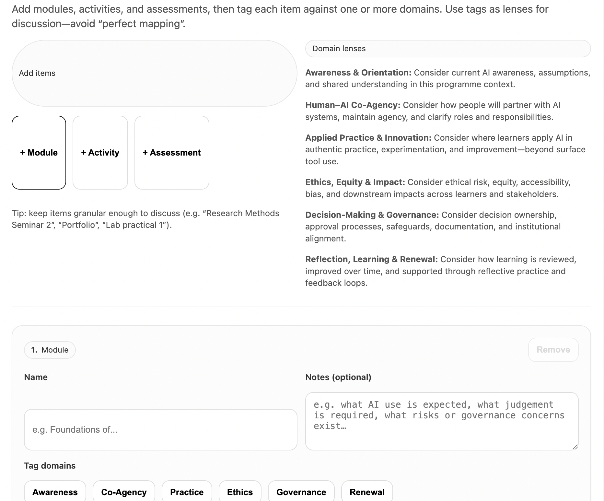

# AI Capability Programme Mapping Tool

A lightweight, browser-based tool for mapping **modules, learning activities, and assessments** against the **six domains of AI capability**, supporting reflective discussion, curriculum design, and quality assurance in education and research contexts.

This tool is part of the **CloudPedagogy AI Capability Tools** suite.


## 🌐 Live Application

👉 http://cloudpedagogy-ai-capability-programme-mapping.s3-website.eu-west-2.amazonaws.com/

---

## 🖼️ Screenshot

The screenshot below shows the **AI Capability Programme Mapping Tool** in use, with modules and activities tagged against different AI capability domains. It illustrates how domain coverage, observations, and reflection prompts are generated dynamically as part of the mapping process.



---
## 🛠️ Getting Started

### Clone the repository

```bash
git clone [repository-url]
cd [repository-folder]
```

### Install dependencies

```bash
npm install
```

### Run locally

```bash
npm run dev
```

Once running, your terminal will display a local URL (often http://localhost:5173). Open this in your browser to use the application.

### Build for production

```bash
npm run build
```

The production build will be generated in the `dist/` directory and can be deployed to any static hosting service.

---

## 🔐 Privacy & Security

- **Fully local**: All data remains in the user's browser  
- **No backend**: No external API calls or database storage  
- **Privacy-preserving**: No tracking or data exfiltration  
- Suitable for use in sensitive organisational and governance contexts  

---

## What this application is

The **AI Capability Programme Mapping Tool** helps educators, curriculum designers, and programme teams:

- make AI capability visible across a programme
- reflect on balance, emphasis, and gaps
- support design conversations and QA discussions
- export a clear, reusable mapping artefact

The tool is **framework-led**, **non-prescriptive**, and designed to support **professional judgement**, not replace it.


---

## What this application is not

This tool is **not**:

- a scoring or benchmarking system  
- a compliance checklist  
- an automated evaluator of quality  
- a replacement for institutional governance processes  

All outputs are **interpretive prompts**, not decisions.

---

## The AI Capability domains

Items are mapped against six interdependent domains:

1. **Awareness & Orientation**  
   Shared understanding, assumptions, AI literacy, and expectations

2. **Human–AI Co-Agency**  
   How people partner with AI systems, maintain agency, and clarify roles

3. **Applied Practice & Innovation**  
   Authentic use of AI in practice, experimentation, and improvement

4. **Ethics, Equity & Impact**  
   Bias, accessibility, risk, and downstream impacts

5. **Decision-Making & Governance**  
   Ownership, safeguards, approval processes, and institutional alignment

6. **Reflection, Learning & Renewal**  
   Review, feedback, iteration, and long-term learning

These domains act as **lenses**, not checkboxes.

---

## How the tool works (user overview)

1. Add **Modules**, **Activities**, and/or **Assessments**
2. Name each item and optionally add notes
3. Tag each item against one or more AI capability domains
4. Review the automatically generated:
   - coverage snapshot
   - observations
   - reflection prompts
5. Optionally add **programme details** (title, award, institution, version)
6. Export the mapping for reuse or discussion

---

## Outputs and exports

### Export Markdown (recommended)

Creates a **QA-ready Markdown report** that includes:

- programme details
- purpose and framing
- domain coverage table
- key observations
- domain lenses
- items grouped by type (modules / activities / assessments)
- reflection prompts
- use and limitations

This output can be pasted directly into:

- programme documentation
- QA or review notes
- curriculum design workshop materials

---

### Export JSON

Creates a **portable data file** containing:

- programme metadata
- all mapping items and domain tags

This can be used to:

- back up your work
- move a mapping between devices or browsers
- re-import a mapping into the tool

---

### Import JSON

Restores a previously exported mapping file, replacing the current browser state.

---

## Data handling and privacy

- The tool runs **entirely client-side**
- Data is stored locally in your browser using `localStorage`
- No data is transmitted, uploaded, or tracked
- Clearing browser storage will remove saved mappings (export first if needed)

This design makes the tool suitable for **static hosting (e.g. AWS S3)**.

---

## Typical use cases

- Programme design workshops
- Curriculum review and refresh cycles
- QA and validation discussions
- Identifying implicit vs explicit AI capability coverage
- Supporting cross-team dialogue about AI use

The tool is especially effective when used **collaboratively**, not individually.

---

## Disclaimer

This repository contains exploratory, framework-aligned tools developed for reflection, learning, and discussion.

These tools are provided **as-is** and are not production systems, audits, or compliance instruments. Outputs are indicative only and should be interpreted in context using professional judgement.

All applications are designed to run locally in the browser. No user data is collected, stored, or transmitted.

---

## Licensing & Scope

This repository contains open-source software released under the MIT License.

CloudPedagogy frameworks and related materials are licensed separately and are not embedded or enforced within this software.

---

## About CloudPedagogy

CloudPedagogy develops open, governance-credible resources for building confident, responsible AI capability across education, research, and public service.

- Website: https://www.cloudpedagogy.com/
- Framework: https://github.com/cloudpedagogy/cloudpedagogy-ai-capability-framework
