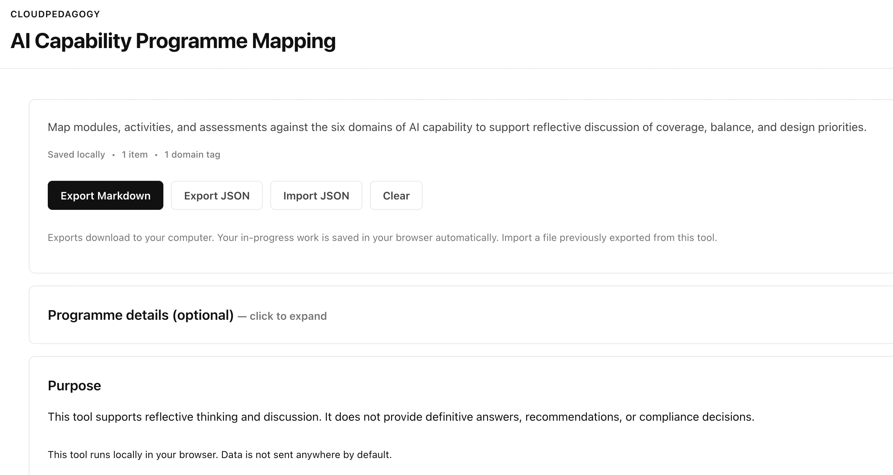

# AI Capability Programme Mapping

A lightweight tool for estimating AI capability coverage and exposure across a full academic programme or curriculum structure.

🌐 **Live Hosted Version**  
http://cloudpedagogy-ai-capability-programme-mapping.s3-website.eu-west-2.amazonaws.com/

🖼️ **Screenshot**  

---

## 🔗 Role in the CloudPedagogy Ecosystem

**Phase:** Phase 3 — Capability System

**Role:**  
Estimates and maps AI capability coverage across curriculum structures (programmes and modules), enabling identification of exposure patterns and alignment gaps.

**Upstream Inputs:**  
- Curriculum structural data from the **Mapping Engine**  
- Baseline capability benchmarks from the **Capability Assessment Tool**

**Downstream Outputs:**  
- Capability-informed insights for the **Curriculum Simulation Tool**  
- Aggregated signals for institutional **Governance Dashboards**

**Does NOT:**  
- Perform detailed workload or assessment simulation  
- Record or audit individual human–AI decision activity  

For a full system overview, see: [SYSTEM_OVERVIEW.md](../SYSTEM_OVERVIEW.md)

---

## Overview

The **AI Capability Programme Mapping** tool bridges the gap between abstract capability frameworks and concrete curriculum implementation.

It enables academic leads to:
- Visualise where AI capability is explicitly developed across a programme  
- Identify uneven or missing capability coverage  
- Detect areas of high AI exposure without corresponding capability development  

This supports more intentional, transparent, and governance-aware curriculum design.

---

## Key Features

- **Mapping Layer**  
  Align modules to the six CloudPedagogy AI Capability domains

- **Exposure Estimation**  
  Estimate cumulative “AI Exposure” across the student journey

- **Alignment Signals**  
  Highlight modules with high AI involvement but low capability development

---

## Disclaimer

This repository contains exploratory, framework-aligned tools developed for reflection, learning, and discussion.

These tools are provided **as-is** and are not production systems, audits, or compliance instruments. Outputs are indicative only and should be interpreted using professional judgement.

- All applications run locally in the browser  
- No user data is collected, stored, or transmitted  
- All example data is synthetic and does not represent real institutions or programmes  

---

## About CloudPedagogy

CloudPedagogy develops open, governance-credible tools for building confident, responsible AI capability across education, research, and public service.

- Website: https://www.cloudpedagogy.com/  
- Framework: https://github.com/cloudpedagogy/cloudpedagogy-ai-capability-framework  